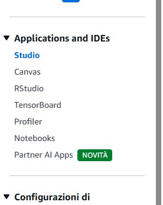
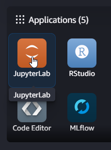
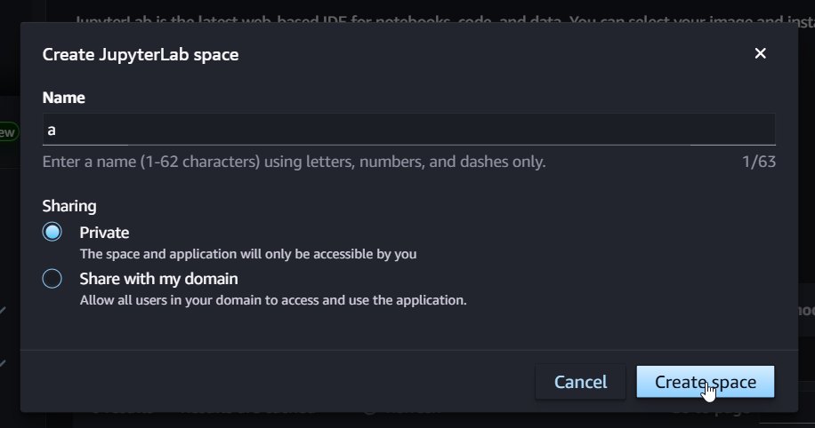
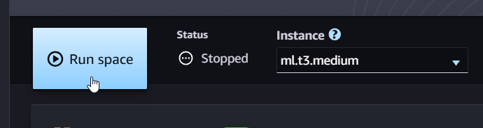
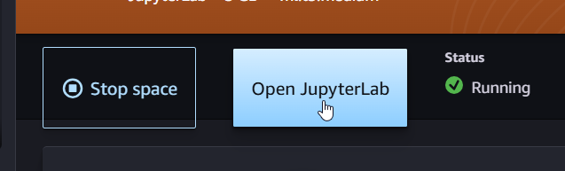
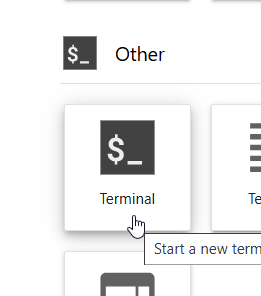
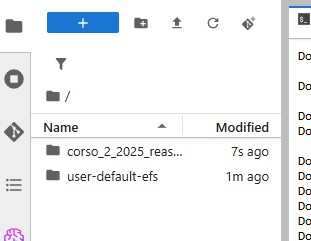

# Comandi da eseguire sulla console di AWS

1. Lancia Amazon SageMaker AI


2. Cliccca su Studio nella barra laterale sinistra



3. Seleziona il tuo profilo utente e clicca su Apri Studio


4. Clicca su JupyterLab



5. Clicca su Create JupyterLab space


6. Inserisci un nome qualsiasi, seleziona Private e clicca su Create space



7. Seleziona l'istanza ml.t3.medium e clicca su Run space. Potrebbe impiegare qualche minuto.



8. Clicca su Open JupyterLab



9. Clicca UNA SOLA VOLTA su Terminal



10. Esegui i seguenti comandi

```bash
pip install --upgrade packaging setuptools
pip install git-remote-codecommit==1.17
rm -rf corso_2_2025_reasoning_models/
git clone codecommit::us-east-1://corso_2_2025_reasoning_models
cd corso_2_2025_reasoning_models
pip install -r requirements.txt
```

11. Clicca sul simbolo della cartella in alto a sinistra e troverai la cartella corso_2_2025_reasoning_models



# Comandi da eseguire in locale

1. Crea una cartella sul tuo computer dove vuoi clonare il repository

2. Apri il terminale e naviga nella cartella appena creata

3. Clona il repository

```bash
git clone https://github.com/ltoffanettireply/corso_2_2025_reasoning_models.git
```
4. Entra nella cartella del progetto

```bash
cd corso_2_2025_reasoning_models
```

4. Crea un ambiente virtuale

```bash
python -m venv .venv
```

5. Attiva l'ambiente virtuale

- Da Windows (PowerShell)

```bash
.\.venv\Scripts\Activate.ps1
```
- Da Windows (cmd)

```bash
.\.venv\Scripts\activate.bat
```
- Da Linux/macOS
```bash
source .venv/bin/activate
```

6. Installa le dipendenze necessarie

```bash
pip install -r requirements.txt
```

7. Apri la cartella `corso_2_2025_reasoning_models` in VSCode
